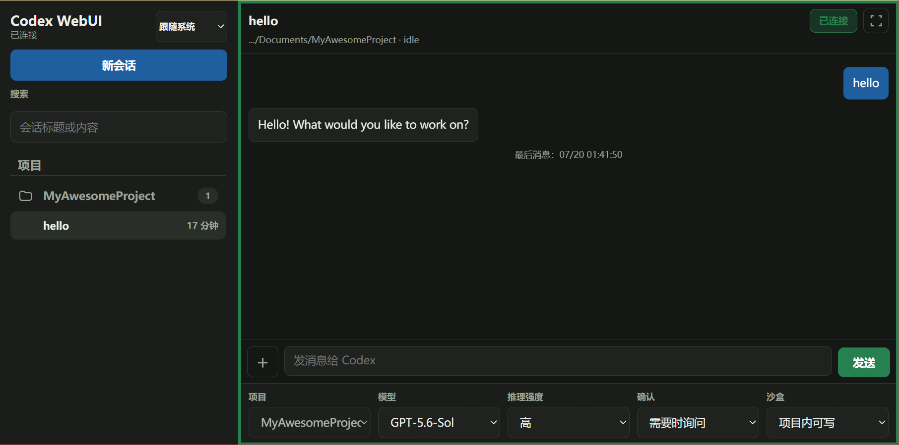

# Codex WebUI

[简体中文](README.md) | [English](README_EN.md)

Codex WebUI 是一个面向 OpenAI Codex 的本地自托管 Web 界面。它通过本机 [`codex app-server`](https://github.com/openai/codex/tree/main/codex-rs/app-server) 复用已登录的 Codex 账号，让手机、平板和电脑在同一局域网内创建、查看和继续 Codex 会话，无需单独填写 OpenAI API Key。支持中英文界面、响应式桌面/移动布局和按项目目录限制的访问 token。

> **非官方衍生项目：** 本项目基于 MIT 许可的 [Codex Mobile / Codex WebUI](https://github.com/wuluwululang/codex-webui) 深度改造并独立维护，与原项目作者或 OpenAI 不存在官方隶属、合作、赞助或背书关系。

<p align="center">
  <strong>在手机上继续电脑里的同一个 Codex 会话，而不是启动第二个 Codex。</strong>
</p>

<p align="center">
  
  
  
  <a href="https://github.com/DusuWorks/codex-webui/actions/workflows/ci.yml"></a>
</p>

| 桌面端 | 移动端 |
| :---: | :---: |
|  |  |

## 它解决什么问题

Codex Desktop 与普通 WebUI 如果各自启动一个 app-server，就可能出现会话 writer 竞争、状态不一致和引导不同步。本项目通过原生 Windows bridge，让 Desktop 和浏览器共享唯一、权威的 app-server：Desktop 仍然拥有登录和会话，WebUI 只负责安全远程访问和实时呈现。

## 核心能力

| 能力 | 说明 |
| --- | --- |
| 单一权威服务 | Desktop 与 WebUI 共享一个 app-server，不读取或修改会话数据库 |
| 双端实时同步 | 消息、流式回复、审批、模型、推理强度、权限和任务状态同步 |
| 项目与会话 | 浏览授权目录、创建工作区、创建/恢复/切换会话 |
| 回复中操作 | 普通发送、立即引导、持久列队、停止当前回复 |
| 图片输入 | 普通发送和回复中引导都支持图片，并等待手机上传完成 |
| 额度监控 | 显示 app-server 实际返回的额度窗口、模型额度和重置时间 |
| 安全访问 | 每设备 token、目录范围、方法白名单、本地文件路径校验 |
| 远程连接 | 局域网直接访问；可选 Cloudflare Tunnel + Access 公网身份验证 |
| 生命周期 | Desktop 启动时自动启动一份 WebUI，并避免重复或误关外部实例 |

## 工作方式

```text
Codex Desktop
      │ stdio JSON-RPC
Desktop bridge / 单一 app-server broker
      │ 本机认证命名管道
Codex WebUI server
      │ 带身份验证的 HTTP / WebSocket
手机、平板或桌面浏览器
```

桥接器的安装、激活、生命周期、配置与故障排查见 [Windows Desktop 桥接器使用手册](docs/DESKTOP_BRIDGE.md)。

## 两种访问方式

| 方式 | 入口验证 | 用法 |
| --- | --- | --- |
| 局域网 | WebUI token | 手机与电脑连接同一局域网，运行 `codex-webui qr default` 后扫码 |
| 公网 | Cloudflare Tunnel + Access 邮箱白名单 | 公网 URL 不携带 token；只有配置的允许邮箱能够登录 |

完整公网部署、允许邮箱配置和验证步骤见 [局域网与公网访问指南](docs/REMOTE_ACCESS.md)。

## 安装

### 让 Codex 帮你安装（推荐）

把本仓库的 GitHub 链接交给 Codex，然后发送：

> 安装这个项目，运行测试并启动服务；最后告诉我怎样用手机扫码连接。

仓库里的 `AGENTS.md` 会告诉 Codex 完成安装、验证和安全初始化所需的步骤。

<details>
<summary><strong>手动安装</strong></summary>

要求：

- Node.js 20 或更新版本、PowerShell 7 或更新版本
- Windows 上已安装并登录 Codex Desktop

```powershell
git clone https://github.com/DusuWorks/codex-webui.git
cd codex-webui
npm install
npm run setup
npm test
pwsh -NoProfile -File scripts/install-desktop-bridge.ps1 -Activate
# 完全退出并重新打开 Codex Desktop
```

`npm run setup` 会安装全局 `codex-webui` 命令。重新打开 Desktop 后，bridge 会自动启动唯一的 WebUI；不要再执行 `npm start`。让手机与电脑连接同一局域网，然后运行 `codex-webui qr default` 生成默认 token 的二维码。Windows 防火墙询问时请选择允许专用网络访问。

多网卡或启用 TUN 的 Windows 主机可以让服务只监听指定局域网地址：

```powershell
powershell -ExecutionPolicy Bypass -File scripts/start-codex-webui.ps1 -HostAddress 192.168.1.20
```

</details>

### 与 Codex Desktop 共享同一个会话 writer（原生 Windows，必需）

> 第一次安装建议直接按 [Windows Desktop 桥接器使用手册](docs/DESKTOP_BRIDGE.md) 操作；下面保留原理和关键命令速查。

Codex WebUI 只使用 Desktop bridge，不会再启动第二个 `codex app-server`。Codex Desktop 通过透明 broker 启动唯一 app-server；WebUI 按选中的 `threadId` 发送并接收同一条实时通知流，因此切换会话不依赖 Desktop 当前显示的输入框。bridge 未连接时服务会保持离线并禁止发送，不会退回竞争 writer。

先只安装并测试启动器（不会修改环境变量，也不会重启 Desktop）：

```powershell
pwsh -NoProfile -File scripts/install-desktop-bridge.ps1
npm test
```

安装器只构建原生 Windows 链路：Windows Node → Windows Codex → 本机认证命名管道。它不探测 WSL，也不提供第二套 TCP app-server 适配。安装采用独立的版本化运行目录，先完整构建再切换，避免中断正在进行的会话。

确认可以安全关闭 Desktop 后再激活。下次重新打开 Desktop 时，bridge 会自动启动 WebUI，不再需要手工运行启动脚本：

```powershell
pwsh -NoProfile -File scripts/install-desktop-bridge.ps1 -Activate
# 现在完全退出并重新打开 Codex Desktop
```

bridge 只在配置端口空闲时启动一份 WebUI；如果 9526 已有手工启动或其他外部实例，它会保留该实例且不重复启动，也不会在 Desktop 退出时误关它。只有 bridge 本次亲自启动的 WebUI 才会随 Desktop 生命周期关闭。要把现有手工实例完全切换为生命周期托管，只需以后停止该实例一次，再重新打开 Desktop。故障排查时可将 `CODEX_WEBUI_DESKTOP_LIFECYCLE=0` 临时禁用自动启动；自定义监听可使用 `CODEX_WEBUI_PORT` 和 `CODEX_WEBUI_HOST_ADDRESS`。

恢复默认 Desktop 启动方式：

```powershell
pwsh -NoProfile -File scripts/install-desktop-bridge.ps1 -Disable
# 完全退出并重新打开 Codex Desktop
```

现有会话的模型、推理强度和权限模式会从共享 app-server 读取；手机修改会同步到 Desktop，Desktop 修改也会实时同步回手机。回复进行中修改设置时从下一轮生效。新建会话可在电脑目录中选择或新建工作区，再选择模型、强度和权限；目录受限 token 只能浏览和创建其授权目录内的工作区。底层沙箱结构不作为独立手机设置暴露。

bridge 模式以 app-server 实时通知为主要读路径；当前会话工作中每约 1 秒轻量校准一次，前台空闲时每约 4 秒校准一次，手机重新回到前台或切换会话时立即读取，以补齐后台或短暂断线期间漏掉的事件。它不会高频扫描全部历史会话。

界面使用紧凑的任务优先布局：等待确认、正在工作和完成未读的会话会进入侧边栏“进行中”区域，最近项目按需要注意的状态和最近会话时间自动排序，并可整体折叠且记住状态；非当前会话完成或失败时会出现可点击的页内通知。侧边栏还通过 `account/rateLimits/read` 显示 app-server 实际返回的各额度窗口和重置时间，包括按模型单独返回的额度，不会自行假设固定月额度。模型、推理强度和权限默认收进设置面板；已有会话显示“当前会话”，只有新建会话才显示明确的工作区选择。

打开会话时只请求最近 6 个 turn 并直接定位到最新内容，不会用平滑动画从历史顶部滚到底。向上滚动由用户手势触发后才会预取上一页，插入旧内容时保留当前可见位置；顶部按钮也可手动加载更早内容。

页面重新打开时会依次尝试 URL 中仍可访问的会话、上次成功打开的会话和最近会话。失效或加载失败的旧 ID 会自动跳过，只有成功加载后才会更新本地记录和地址栏。

流式回复期间，用户主动向上阅读会暂停自动跟随到底部，回到最新位置或发送新消息后恢复；已展开的工具、推理和自动化明细在增量重绘后保持原状态。推理记录统一标为“推理过程”，明确说明它是模型工作摘要而不是已执行命令。当前已加载历史中的结构化图片使用浏览器懒加载预览，点击仍进入全屏原图；公网缩略图优化留给后续公网 Requirement。

回复进行中时，输入栏仍只占用一个操作按钮；点击“选择”后会在输入栏上方打开适合手机触控的“立即引导 / 加入列队 / 停止当前回复”选择层。“立即引导”使用 `turn/steer` 和精确的 active turn ID，把文字或图片加入当前回复；选择多张图片后只需点一次，引导会等待全部图片准备和上传完成再提交，不会因手机上传尚未结束而丢失本次点击。“加入列队”使用 app-server 的持久会话队列，当前回复完成后按顺序开始下一条；“停止当前回复”使用 `turn/interrupt` 精确中断当前 active turn，并由权威终态通知同步 Desktop 与 WebUI。空闲时仍显示普通“发送”并使用 `turn/start`。`attestation/generate`、凭证刷新、动态工具调用等 Desktop 内部 server request 不会显示成手机审批，WebUI 只展示自身能够正确回答的命令、文件和补充信息请求。

`-Restart` 仍可用于手工维护，并且只会在端口 owner、WebUI PID 文件和 `node.exe` 进程同时匹配时重启 WebUI 进程树；WMI 能读取命令行时还必须匹配 `server/index.js`。它不会重启 Desktop 或代理。正常使用不需要常驻监督服务：Desktop bridge 在成功占用认证命名管道后直接启动 WebUI，并由 launcher 的 Windows Job 提供异常退出清理。启动器、日志和随机密钥位于本机 `CODEX_WEBUI_DATA_DIR`（默认 `%LOCALAPPDATA%\CodexWebUI`），不会写入 AppX 安装目录。桥接器不向局域网暴露 raw app-server。Desktop 更新不会覆盖启动器；如果本仓库或 Windows Node 位置变化，需要重新运行安装脚本。

## 使用与安全

> [!WARNING]
> 访问链接和二维码相当于远程控制凭证。泄露后，他人可能读取会话、启动任务并操作 token 授权目录中的文件。请勿公开分享；怀疑泄露时立即停用或轮换对应 token。

### 常见问题

- **需要 OpenAI API Key 吗？** 不需要，Codex WebUI 使用本机已有的 Codex 登录。
- **能限制访问范围吗？** 可以，每个 token 可绑定一个或多个项目目录。
- **支持哪些设备？** 支持同一局域网内的桌面和移动浏览器。
- **为什么必须使用 Desktop bridge？** 两个独立 app-server 会争用同一个会话 writer；本项目只保留共享 Desktop writer 的安全路径。

### Token 管理

Codex WebUI 首次设置时会生成一个本地访问 token。推荐直接通过 Codex 管理：

1. 安装完成后，在 Codex 桌面端按 `Ctrl+O` 打开安装目录，将 Codex WebUI 添加为项目。
2. 在该项目下新建一个会话。
3. 将下面任一消息发送给 Codex：

> 列出我的 Codex WebUI token。
>
> 给 `E:\MyProject` 创建一个名为 `phone` 的手机 token，只允许访问这个目录，并生成二维码。
>
> 给 `tablet` token 增加 `E:\ProjectA` 和 `E:\ProjectB` 两个可访问目录。
>
> 生成 `phone` 的手机二维码或访问链接。
>
> 轮换 / 停用 / 删除 `phone` token。
>
> 查看 `phone` token 的使用统计。

<details>
<summary><strong>命令行管理（可选）</strong></summary>

安装完成后，也可以在任意目录使用 `codex-webui` 命令：

```powershell
# 默认不显示明文，只显示短指纹和目录权限
codex-webui list

# 创建只能访问一个项目目录的 token
codex-webui add phone --label "My phone" --cwd "E:\MyProject"

# 一个 token 可允许多个目录
codex-webui add tablet --cwd "E:\ProjectA" --cwd "E:\ProjectB"

# 生成完整访问地址与二维码（会显示密钥）
codex-webui qr phone

# 多网卡环境可显式指定手机能够访问的局域网地址
codex-webui qr phone --host http://192.168.1.20:9526

# 轮换、停用或删除
codex-webui rotate phone
codex-webui disable phone
codex-webui remove phone --yes

# 查看使用情况
codex-webui stats
codex-webui stats phone
```

运行 `codex-webui help` 可查看完整命令。

</details>

运行中的服务会自动重新加载 token 变更。轮换、停用或删除后，旧连接会在下一次请求时断开。

## Windows 独立 Cloudflare Tunnel connector

> 完整流程和邮箱白名单验证见 [局域网与公网访问指南](docs/REMOTE_ACCESS.md)。公网方式使用 Cloudflare Tunnel + Access；只有 `-AllowedEmail` 指定的邮箱能够通过 WebUI 服务端校验。

当默认的 `Cloudflared` Windows 服务已经用于其他隧道时，不要运行 Cloudflare 页面生成的 `cloudflared service install <TOKEN>` 命令。请使用独立安装脚本：

```powershell
powershell -ExecutionPolicy Bypass -File scripts/install-cloudflared-ai.ps1 -ExpectedTunnelId "<AI-TUNNEL-UUID>"
```

请从管理员 PowerShell 运行。脚本会以隐藏输入读取远程管理 Tunnel token，先验证 token 属于指定 Tunnel，再将它写入仅 SYSTEM/Administrators 可读的 `%ProgramData%\cloudflared-ai\token`，并且只创建或重启 `CloudflaredAI` 服务。脚本不会修改默认 `Cloudflared` 服务，也不会添加防火墙规则。

安装前可以运行只读预检：

```powershell
powershell -ExecutionPolicy Bypass -File scripts/install-cloudflared-ai.ps1 -ExpectedTunnelId "<AI-TUNNEL-UUID>" -ValidateOnly
```

Cloudflare 显示独立 Tunnel 为正常后，再添加 Published application route，例如把公网主机名映射到 `http://192.168.1.20:9526`。这里的 HTTP 只是本地源站协议；公网 WebSocket 仍使用 `wss://`。

Published application route 和 Cloudflare Access 策略建立后，运行下面的配置脚本，让公网浏览器使用经过签名验证的 Cloudflare Access 身份，而不是在公网 URL 中携带 WebUI token：

```powershell
powershell -ExecutionPolicy Bypass -File scripts/configure-cloudflare-access.ps1 `
  -PublicUrl "https://codex.example.com" `
  -AllowedEmail "owner@example.com" `
  -TokenScopeId "phone"
```

脚本只把 Access team domain、应用 audience、允许邮箱和可选的目录权限 scope 写入 `%LOCALAPPDATA%\CodexWebUI\cloudflare-access.json`；不会保存登录 cookie、JWT 或 Tunnel token。重启 Codex WebUI 后，服务器会验证 `Cf-Access-Jwt-Assertion` 的签名、issuer、audience、有效期和邮箱；不在白名单中的邮箱会被拒绝。局域网访问仍必须使用原来的 WebUI token。

## 开发

```powershell
npm run check
npm test
```

后端不会启动独立 app-server。Desktop bridge 通过 `CODEX_CLI_PATH` 在原生 Windows 中透明启动唯一 app-server，并通过本机认证命名管道把请求 ID 路由和通知扇出提供给 WebUI。网页请求仍经过方法白名单、目录会话过滤和文件/工作区访问校验。

设计、信任边界和兼容性说明见 [架构文档](docs/ARCHITECTURE.md)，远程访问见 [局域网与公网访问指南](docs/REMOTE_ACCESS.md)。安全问题请按 [安全策略](SECURITY.md) 私下报告，贡献代码前请阅读 [贡献指南](CONTRIBUTING.md)。

## 来源与致谢

本项目基于 [Codex Mobile / Codex WebUI](https://github.com/wuluwululang/codex-webui) 的 `a36c4767b829cf54b3a6a7971d9129c4093c3a8e` 版本开发，原项目采用 MIT License。当前版本围绕 Windows Codex Desktop 的唯一 app-server 共享路线，新增或重写了 Desktop bridge、双端实时同步、项目创建、发送/引导/列队/停止、图片输入、额度监控、目录权限和可选公网访问。完整声明见 [NOTICE](NOTICE.md)。

## License

[MIT](LICENSE)；依赖许可证见 [第三方声明](THIRD_PARTY_NOTICES.md)。
