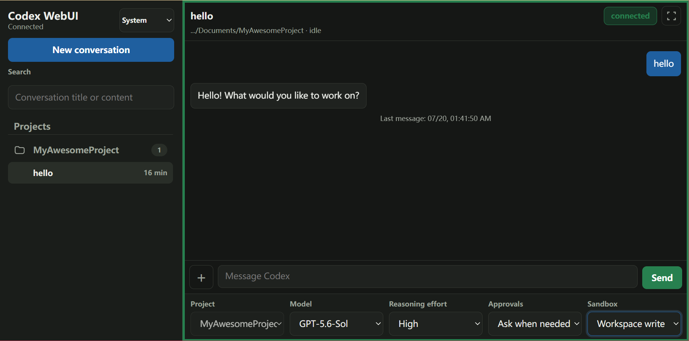

# Codex WebUI

[简体中文](README.md) | [English](README_EN.md)

Codex WebUI is a local, self-hosted web interface for OpenAI Codex. It uses the local [`codex app-server`](https://github.com/openai/codex/tree/main/codex-rs/app-server) and your existing Codex sign-in, so phones, tablets, and computers on the same LAN can create, view, and continue Codex conversations without a separate OpenAI API key. It includes English and Chinese interfaces, responsive desktop/mobile layouts, and directory-scoped access tokens.

> **Unofficial derivative project:** This project is independently maintained and deeply modified from the MIT-licensed [Codex Mobile / Codex WebUI](https://github.com/wuluwululang/codex-webui). It is not officially affiliated with, sponsored by, or endorsed by the original project authors or OpenAI.

<p align="center">
  <strong>Continue the same Codex Desktop conversation from your phone instead of starting a second Codex.</strong>
</p>

<p align="center">
  
  
  
  <a href="https://github.com/DusuWorks/codex-webui/actions/workflows/ci.yml"></a>
</p>

| Desktop | Mobile |
| :---: | :---: |
|  |  |

## What it solves

Running separate app-servers for Codex Desktop and a WebUI can create competing conversation writers, inconsistent state, and follow-ups that appear on only one surface. This project uses a native Windows bridge so Desktop and browsers share one authoritative app-server. Desktop continues to own authentication and conversations; WebUI provides secure remote access and live presentation.

## Core capabilities

| Capability | Description |
| --- | --- |
| One authoritative service | Desktop and WebUI share one app-server without reading or modifying conversation storage |
| Live two-way sync | Messages, streaming output, approvals, model, reasoning effort, permissions, and task state |
| Projects and conversations | Browse allowed folders, create workspaces, and create/resume/switch conversations |
| Active-response actions | Send normally, guide now, join the persistent queue, or stop the current response |
| Image input | Images work in normal sends and active guidance, with upload completion enforced |
| Rate-limit monitoring | Shows app-server windows, model-specific limits, and reset times |
| Secure access | Per-device tokens, directory scopes, method allowlists, and local-path checks |
| Remote connectivity | Direct LAN access plus optional Cloudflare Tunnel and Access identity verification |
| Desktop lifecycle | Starts one WebUI with Desktop while preventing duplicates and preserving external instances |

## How it works

```text
Codex Desktop
      │ stdio JSON-RPC
Desktop bridge / single app-server broker
      │ authenticated local named pipe
Codex WebUI server
      │ authenticated HTTP / WebSocket
Phone, tablet, or desktop browser
```

See the [Windows Desktop bridge guide](docs/DESKTOP_BRIDGE.md) for installation, activation, lifecycle behavior, configuration, and troubleshooting.

## Two access paths

| Path | Entry authentication | Usage |
| --- | --- | --- |
| Trusted LAN | WebUI token | Put the phone and computer on the same LAN, run `codex-webui qr default`, and scan |
| Internet | Cloudflare Tunnel + Access email allowlist | The public URL has no token; only the configured email can sign in |

See [LAN and Internet Access](docs/REMOTE_ACCESS.md) for the complete public deployment, email allowlist, and verification procedure.

## Installation

### Install with Codex (Recommended)

Give Codex the GitHub URL for this repository, then send:

> Install this project, run its tests, and start the service. Finally, tell me how to connect from my phone by scanning the QR code.

The repository's `AGENTS.md` tells Codex how to install, verify, and initialize the project safely.

<details>
<summary><strong>Manual installation</strong></summary>

Requirements:

- Node.js 20 or later and PowerShell 7 or later
- A signed-in Codex Desktop installation on Windows

```powershell
git clone https://github.com/DusuWorks/codex-webui.git
cd codex-webui
npm install
npm run setup
npm test
pwsh -NoProfile -File scripts/install-desktop-bridge.ps1 -Activate
# Fully quit and reopen Codex Desktop
```

`npm run setup` installs the global `codex-webui` command. After Desktop reopens, the bridge automatically starts the single WebUI; do not run `npm start` again. Connect the phone and computer to the same LAN, then run `codex-webui qr default` to generate the default token's QR code. If Windows Firewall prompts you, allow private-network access.

On a multi-homed or TUN-enabled Windows host, bind the service to one LAN address:

```powershell
powershell -ExecutionPolicy Bypass -File scripts/start-codex-webui.ps1 -HostAddress 192.168.1.20
```

</details>

### Share the same conversation writer with Codex Desktop (native Windows, required)

> For a first installation, follow the [Windows Desktop bridge guide](docs/DESKTOP_BRIDGE.md). The section below remains a quick reference for the design and commands.

Codex WebUI only uses the Desktop bridge and never starts a second `codex app-server`. Codex Desktop launches the only app-server through a transparent broker. The WebUI sends to the selected `threadId` and receives the same live notification stream, so conversation switching does not depend on Desktop's visible input box. If the broker is unavailable, the service fails closed instead of starting a competing writer.

First install and test the launcher without changing environment variables or restarting Desktop:

```powershell
pwsh -NoProfile -File scripts/install-desktop-bridge.ps1
npm test
```

The installer builds only the native Windows chain: Windows Node → Windows Codex → an authenticated local named pipe. It does not probe WSL or provide a second TCP app-server adapter. Installation uses a versioned runtime directory and completes the build before switching so active work is not interrupted.

When it is safe to close Desktop, activate the launcher. The bridge starts WebUI automatically the next time Desktop opens, so no separate startup command is required:

```powershell
pwsh -NoProfile -File scripts/install-desktop-bridge.ps1 -Activate
# Fully quit and reopen Codex Desktop now
```

The bridge starts one WebUI only when the configured port is free. If port 9526 already belongs to a manually started or external instance, that instance is preserved, no duplicate is launched, and Desktop shutdown does not terminate it. Only a WebUI child created by the current bridge follows the Desktop lifecycle. To transition an existing manual instance to lifecycle ownership, stop it once and reopen Desktop. Set `CODEX_WEBUI_DESKTOP_LIFECYCLE=0` to disable automatic startup temporarily for troubleshooting; use `CODEX_WEBUI_PORT` and `CODEX_WEBUI_HOST_ADDRESS` for a custom listener.

To restore the default Desktop launch path:

```powershell
pwsh -NoProfile -File scripts/install-desktop-bridge.ps1 -Disable
# Fully quit and reopen Codex Desktop
```

Existing conversations read their authoritative model, reasoning effort, and permission mode from the shared app-server. Mobile changes synchronize to Desktop, and Desktop changes synchronize back to mobile. Settings changed during an active response apply to the next turn. New conversations can select or create a computer workspace before choosing model, effort, and permissions. Directory-scoped tokens can only browse or create workspaces under their allowed roots. Raw sandbox structures are not exposed as a separate mobile setting.

Bridge mode uses app-server notifications as its primary read path. It lightly reconciles the selected conversation about once per second while working and about every four seconds while visible and idle. Returning from the background or switching conversations triggers an immediate read, without frequently scanning every historical conversation.

The interface uses a compact, task-first layout. Conversations that need confirmation, are currently working, or completed unread move into the sidebar's Active section. Recent projects sort automatically by attention and latest conversation activity, and each group can be collapsed with its state remembered locally. Completing or failing a background conversation produces a clickable in-page notification. The sidebar also uses `account/rateLimits/read` to show every usage window and reset time actually returned by app-server, including model-specific limits, without inventing a fixed monthly quota. Model, reasoning, and permission controls stay in the collapsed settings sheet; existing threads identify the current conversation, while only drafts expose the explicit workspace chooser.

Opening a conversation requests only the latest six turns and lands directly on the newest content instead of smoothly traversing from the top. Older pages preload only after explicit upward user scroll intent, preserve the visible anchor when inserted, and remain available through the manual history control.

When the page reopens, it tries an accessible conversation from the URL, the last successfully opened conversation, and then the most recent conversation. Stale or unloadable IDs are skipped automatically, and local state plus the URL are updated only after a successful load.

During a live response, explicit upward reading pauses bottom-follow until the user returns to the newest content or sends again. Expanded tool, reasoning, and automation disclosures survive incremental rerenders. Reasoning records use a stable Reasoning label and explain that they are model work summaries rather than executed commands. Structured images in the loaded history use browser-native lazy previews and still open the full-screen source; public-network thumbnail optimization remains deferred to the later Internet-access requirement.

While a response is running, the composer still consumes only one action-button slot. Tapping Choose opens a touch-friendly Guide now / Join queue / Stop current response sheet above the mobile composer. Guide now calls `turn/steer` with the exact active turn ID and adds text or images to the current response. A single tap after selecting multiple images waits for every image to finish preparation and upload before steering, so a slower phone upload cannot discard the action. Join queue uses the app-server's persistent thread queue and starts each follow-up in order after the active response completes. Stop current response calls `turn/interrupt` for the exact active turn and converges Desktop plus WebUI through the authoritative terminal notification. Idle sends still show Send and call `turn/start`. Desktop-only server requests such as `attestation/generate`, token refresh, and dynamic tool calls are never rendered as mobile approvals; the WebUI exposes only command, file, and user-input requests it can answer correctly.

`-Restart` remains available for manual maintenance and restarts the WebUI process tree only when the port owner, WebUI PID file, and `node.exe` process all match. If WMI exposes the command line, it must also match `server/index.js`. It does not restart Desktop or the proxy. Normal use needs no resident supervisor: the Desktop bridge starts WebUI after claiming its authenticated named pipe, and the launcher's Windows Job supplies abrupt-exit cleanup. The launcher, logs, and random secret live in local `CODEX_WEBUI_DATA_DIR` (default `%LOCALAPPDATA%\CodexWebUI`), not in the AppX installation. The bridge never exposes raw app-server to the LAN. Desktop updates do not overwrite the launcher. Re-run the installer if this repository or Windows Node moves.

## Usage and security

> [!WARNING]
> Access links and QR codes are remote-control credentials. If one leaks, another person may read conversations, start tasks, and operate on files within the token's authorized directories. Never share them publicly; disable or rotate the token immediately if exposure is suspected.

### Frequently asked questions

- **Does it require an OpenAI API key?** No. Codex WebUI uses the existing Codex sign-in on your computer.
- **Can access be restricted?** Yes. Each token can be limited to one or more project directories.
- **Which devices are supported?** Desktop and mobile browsers on the same LAN.
- **Why is the Desktop bridge required?** Two independent app-servers compete for one conversation writer. This project only keeps the shared Desktop writer path.

### Token management

Codex WebUI creates a local access token during initial setup. Managing it directly through Codex is recommended:

1. After installation, press `Ctrl+O` in the Codex desktop app and open the installation directory to add Codex WebUI as a project.
2. Start a new conversation under that project.
3. Send Codex any of the following messages:

> List my Codex WebUI tokens.
>
> Create a mobile token named `phone` that can only access `E:\MyProject`, then generate its QR code.
>
> Allow the `tablet` token to access both `E:\ProjectA` and `E:\ProjectB`.
>
> Generate a mobile QR code or access link for `phone`.
>
> Rotate / disable / delete the `phone` token.
>
> Show usage statistics for the `phone` token.

<details>
<summary><strong>Command-line management (Optional)</strong></summary>

After installation, you can also use the `codex-webui` command from any directory:

```powershell
# Show fingerprints and folder permissions without revealing token secrets
codex-webui list

# Create a token restricted to one project directory
codex-webui add phone --label "My phone" --cwd "E:\MyProject"

# Allow one token to access multiple directories
codex-webui add tablet --cwd "E:\ProjectA" --cwd "E:\ProjectB"

# Generate the complete access URL and QR code (reveals the secret)
codex-webui qr phone

# Override automatic LAN address selection on a multi-adapter system
codex-webui qr phone --host http://192.168.1.20:9526

# Rotate, disable, or delete a token
codex-webui rotate phone
codex-webui disable phone
codex-webui remove phone --yes

# Inspect usage
codex-webui stats
codex-webui stats phone
```

Run `codex-webui help` to see all commands.

</details>

A running server reloads token changes automatically. After a token is rotated, disabled, or deleted, its old connections are rejected on their next request.

## Dedicated Cloudflare Tunnel connector on Windows

> See [LAN and Internet Access](docs/REMOTE_ACCESS.md) for the complete flow and email-allowlist checks. Internet access uses Cloudflare Tunnel + Access, and the WebUI accepts only the `-AllowedEmail` identity.

If the default `Cloudflared` Windows service already belongs to another tunnel, do not run Cloudflare's generated `cloudflared service install <TOKEN>` command. Use the dedicated installer instead:

```powershell
powershell -ExecutionPolicy Bypass -File scripts/install-cloudflared-ai.ps1 -ExpectedTunnelId "<AI-TUNNEL-UUID>"
```

Run it in an Administrator PowerShell window. The installer reads the remotely managed Tunnel token through hidden input, verifies its tunnel ID, stores it in an ACL-protected `%ProgramData%\cloudflared-ai\token`, and only creates or restarts `CloudflaredAI`. It does not modify the default `Cloudflared` service or add firewall rules.

After the tunnel, Published application route, and Cloudflare Access policy are ready, configure signed Access identity authentication without putting a WebUI token in the public URL:

```powershell
powershell -ExecutionPolicy Bypass -File scripts/configure-cloudflare-access.ps1 `
  -PublicUrl "https://codex.example.com" `
  -AllowedEmail "owner@example.com" `
  -TokenScopeId "phone"
```

The configurator stores only the Access team domain, application audience, allowed email, and optional directory scope in `%LOCALAPPDATA%\CodexWebUI\cloudflare-access.json`. It does not store login cookies, JWTs, or Tunnel tokens. After the WebUI restarts, the server validates the `Cf-Access-Jwt-Assertion` signature, issuer, audience, lifetime, and email; an email outside the allowlist is rejected. LAN access continues to require the original WebUI token.

## Development

```powershell
npm run check
npm test
```

The backend never starts a standalone app-server. The Desktop bridge uses `CODEX_CLI_PATH` to launch the single transparent app-server and exposes request-ID routing plus notification fan-out to the WebUI through an authenticated local named pipe. Browser requests still pass through the method allowlist, conversation filtering, and file/workspace access checks.

See [Architecture](docs/ARCHITECTURE.md) for design, trust boundaries, and compatibility notes, and [LAN and Internet Access](docs/REMOTE_ACCESS.md) for remote deployment. Report vulnerabilities privately under the [Security Policy](SECURITY.md), and read [Contributing](CONTRIBUTING.md) before submitting code.

## Origin and acknowledgements

This project is based on revision `a36c4767b829cf54b3a6a7971d9129c4093c3a8e` of [Codex Mobile / Codex WebUI](https://github.com/wuluwululang/codex-webui), licensed under the MIT License. The current version adds or rewrites the Windows Codex Desktop bridge, shared single-app-server synchronization, project creation, send/guide/queue/stop actions, image input, rate-limit monitoring, directory controls, and optional public access. See [NOTICE](NOTICE.md) for the complete statement.

## License

[MIT](LICENSE). Dependency licenses are listed in [Third-Party Notices](THIRD_PARTY_NOTICES.md).
